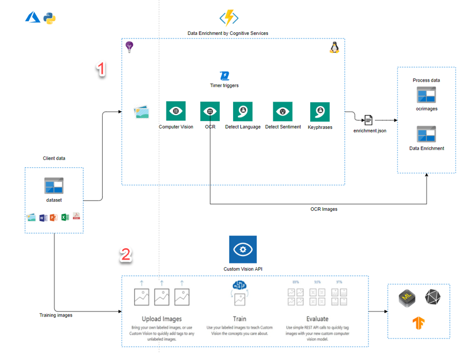

# Lab01 - Cognitive Services

## Pre-requisites to deploying this demo

1. Ananconda
    - Instalation: https://www.anaconda.com/distribution/
    - Conda commands to create local env: ```conda create -n myenv python=3.6```
    - conda env create -f environment.yml
2. Active Azure Subscription

## Use Case: Mass Ingestion of Journalism Documents

There are quite a few Azure services that can be used right out of the box to provide Machine Learning and Artificial Intelligence in the [Azure Cognitive Services](https://azure.microsoft.com/en-us/services/cognitive-services/) suite. There are text, computer vision, facial recognition, video indexing, etc. services that offer some powerful functionality without you, the user, ever having to write a line of code or understand the machine learning concepts that underpin them.

However, it would be potentially too confusing to create an example that uses each and every feature, with the permutations, in each and every available cognitive service so this demo has hand picked a few services to use in a coherent way.

So, you ask, what is this demo about? In short, this demo shows how to set up a pipeline for mass ingestion and near-realtime analysis of journalism documents to provide useful insights as the documents are being stored into durable storage.

#### Pipeline Architecture / Data Flow



This demo is a series of Azure Services stitched together to process digital articles that contain media (images).

This generator is used to populate a blob storage Collection with old newspapers of new york times, dated(1851–1922) which then trigger the following actions:

1. Te first and the only function have a timer trigger execution by checking the datetime of the files or document inserts into database in the collection.
    - Image(s) are stored in an Azure Storage Account as blobs during the ingest process.
    - Only documents uploaded today will be preprocessed

2. The Detect step utilizes the Vision Azure Cognitive Services. If images are present on the article, the following steps are taken:
    - Detect objects and landmarks in the image using the Detect API.
    - Detect written words in the image using the OCR API.
    - Save OCR text into the images and upload to blob storage container.

3. The text analytics step containing the article document information by the text extracted at the OCR step id and utilizes de Text Analytics Azure Cognitive Services.
    - Detect the language of the existing title and body of the article content, and determine whether:
        - The language can be translated
        - The language is different than the pre-defined translation language
    - When necessary, translate the title and body text of the article.
    - Where present, collect the sentiment, key phrases, and entities from both the body and the title.

The "requirements" for this project are that, for each document ingested into the pipeline, it must:

Without Azure Cognitive Services, you'd probably be scratching your head on how to accomplish these tasks. However, the base cognitive services offered in Azure provide these services directly out of the box. Specifically, the services that will be utilized are:

#### Azure Cognitive Services used in this demo

Cognitive Service | Purpose
:---------------------:| ---
[Translation API](https://azure.microsoft.com/en-us/services/cognitive-services/translator-text-api/) | Determines the language of the incoming title and body, when present, then translates them to English. However, the target language is just another input and can be changed from English to any [supported language](https://docs.microsoft.com/en-us/azure/cognitive-services/translator/reference/v3-0-languages) of your choice.
[Text Analytics](https://azure.microsoft.com/en-us/services/cognitive-services/text-analytics/) | Used to find <i>key word phrases</i> and <i>entities</i> in title and body text after it has been translated.
[Computer Vision](https://azure.microsoft.com/en-us/services/cognitive-services/computer-vision/)|Inspects each image associated with an incoming article to (1) scrape out written words from the image and (2) determine what types of objects are present in the image.

#### Other Azure Services

Azure Service | Purpose
:---------------------:| ---
[Azure Storage](https://azure.microsoft.com/en-us/services/storage/)|Holds images from articles and hosts the code for the Azure Functions.
[Azure Functions](https://azure.microsoft.com/en-us/try/app-service/)|Code blocks that analyze the documents stored in the Azure Storage.

#### Repository Content
