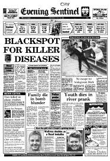
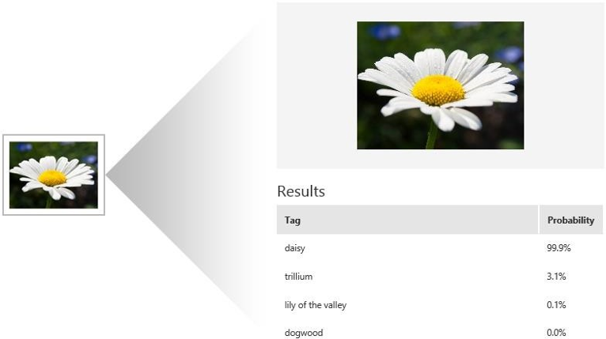
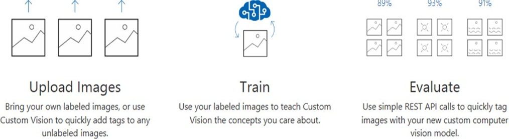
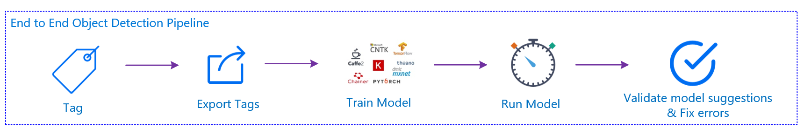
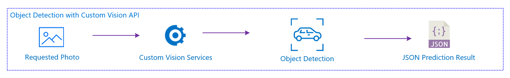

# Lab02 - Custom Vision

## Building a custom image classification solution with Custom Vision Service

In this lab you will train, evaluate, and deploy a custom image classification model using Microsoft Cognitive Services Custom Vision Service.

The Custom Vision Service is an Azure Cognitive Service that lets you build custom image classifiers and object detectors. The Custom Vision Service provides a REST API and a web interface to orchestrate model training and operationalization.

The lab is designed to be instructor guided.  In addition to walking you through the lab's steps, the instructor will explain key concepts and as necessary deep dive into technical details.

Don't hesitate to ask questions!

## What will you learn during the lab?

The lab consists of 2 parts:

- In the first part you will train, evaluate and test a custom image classification model.
- In the second part, you will learn how to operationalize it.

## Scenario

Custom Vision Services has new features to classify quickly different kind of images, In this sample you'll be able to use custom vision services to classify Old newspapers and Newspapers in your photos.

Actual journal newspapers  |  Old journal newspapers
:-------------------------:|:-------------------------:
  |  

You can walk through the lab in two ways:

- Using Custom Vision Service web interface
- Using Custom Vision Service Python SDK

Both versions of the lab require  **Custom Vision** **Training** and **Prediction** services in Azure.

## Provision Custom Vision services in Azure

1. Login to Azure Portal using credentials bound to your Azure subscription:
http://portal.azure.com

2. Navigate to Cognitive Services blade in Azure Portal. You can browse through the portal starting with **Create a resource** link or take a shortcut using the following link.
https://ms.portal.azure.com/#create/Microsoft.CognitiveServicesCustomVision

3. Enter a name for your service

4. Choose **West Europe** location

5. Choose **F0** Prediction pricing tier

6. Choose **F0** Training pricing tier

7. **Create new** Resource group

## Pipeline & Flow

This program helps you to upload all your photos to apply end to end object classification pipeline.

After trained model you'll be able to predict your objects.

