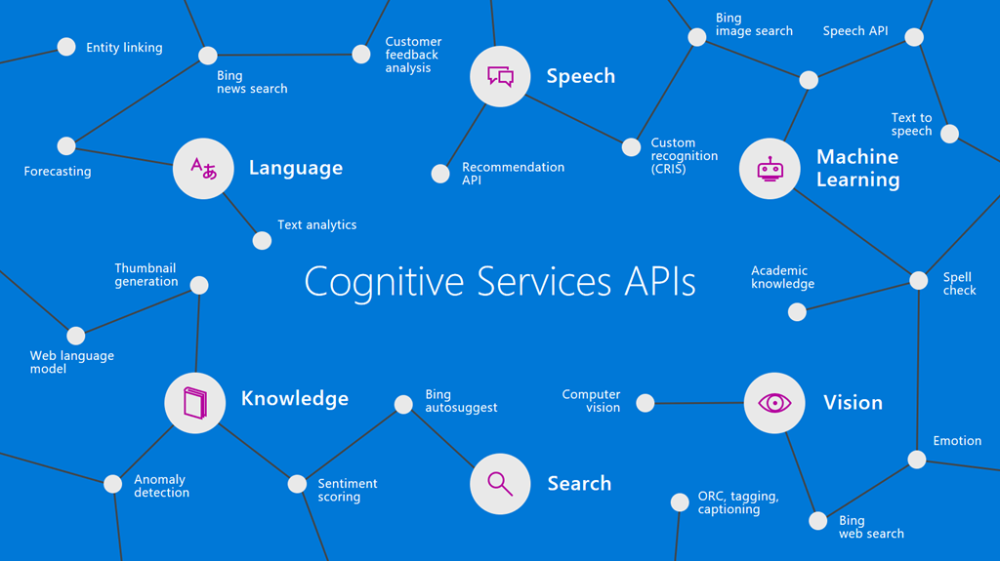

# Cognitive services Labs

This repository is a sample to created and simulate differente scenarios using Azure Cognitive Services with the main goal of connect a easy creation application with Azure functions(serverless solutions) within [Azure Functions](https://azure.microsoft.com/en-us/services/functions/). Also using Computer Vision services, like Custom Vision [Azure Custom Vision](https://www.customvision.ai/)

## Labs

 1. ### [Lab-01. Cognitive Services](./Lab-01/Readme.md)

There are quite a few Azure services that can be used right out of the box to provide Machine Learning and Artificial Intelligence in the [Azure Cognitive Services](https://azure.microsoft.com/en-us/services/cognitive-services/) suite. There are text, computer vision, facial recognition, video indexing, etc. services that offer some powerful functionality without you, the user, ever having to write a line of code or understand the machine learning concepts that underpin them.

However, it would be potentially too confusing to create an example that uses each and every feature, with the permutations, in each and every available cognitive service so this demo has hand picked a few services to use in a coherent way.

So, you ask, what is this demo about? In short, this demo shows how to set up a pipeline for mass ingestion and near-realtime analysis of journalism documents to provide useful insights as the documents are being stored into durable storage.

 2. ### [Lab-02. Custom Vision](./Lab-02/Readme.md)

 In this lab you will train, evaluate, and deploy a custom image classification model using Microsoft Cognitive Services Custom Vision Service.

The Custom Vision Service is an Azure Cognitive Service that lets you build custom image classifiers and object detectors. The Custom Vision Service provides a REST API and a web interface to orchestrate model training and operationalization.

The lab is designed to be instructor guided. In addition to walking you through the lab's steps, the instructor will explain key concepts and as necessary deep dive into technical details.

Don't hesitate to ask questions!

 3. ### [Lab-03. Knowledge Mining with Azure Search](./Lab-03/Readme.md)

 In this lab you will have the content and information to do a complete Azure Search deploy on Azure, creating the connection to Azure Blob Storage, skillset, indexer and index to make queries about journalism documentation.
